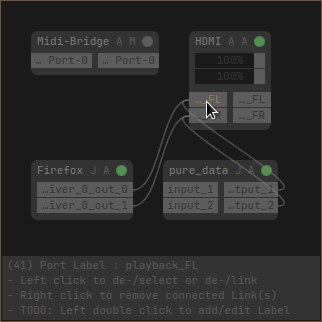

# PipeFlow

Fun-In-Progress GUI for [PipeWire](https://pipewire.org/)



## Features

- Display Nodes, Ports and Links
- Create and destroy Links
- Set channel volume (for ALSA and PulseAudio)
- Move Nodes (but will be reset after model changes!)

## Todo

- user change node/port label
- user set auto/default links/nodes!
- how to best auto layout?
- can we set all (audio) nodes channelVolume?
  - seems we can for alsa and pulse. what about jack?
- what is softVolume?
- show live audio levels?
- un/lock channel volume sliders
- can we use https://gitlab.com/matpi/pipewire-py ?
  - i guess we would look `pw-dump` code for howto?

## Bugs

- Link lines are drawn on wrong position on X11 (for you too?)
- find them polish loops... (and why does it still work, or what is not working?!)

## Theme

`theme.ini` file is loaded from these dirs in this order:

- Next to program
- User: `$XDG_CONFIG_HOME/pipeflow`  (default `$HOME/.config/pipeflow`)
- System: `pipeflow` dir in `$XDG_CONFIG_DIRS` (default `/etc/xdg/`)

## Requirements

- `pyside6` - https://doc.qt.io/qtforpython-6/
  - `python3` - https://www.python.org/
  - `qt6-declarative` - https://doc.qt.io/qt-6/qtqml-index.html
- `pw-dump`, `pw-link` and `pw-cli` - https://pipewire.org/

## Packaging

- Copy dir `libpipeflow` to Pythons system include dir
- Copy dir `PipeFlow` to QMLs system include dir
- Copy file `pipeflow` to system bin dir
- Copy file `main.qml` to `/usr/lib/pipeflow/main.qml`
- Copy file `theme.ini` to `/etc/xdg/pipeflow/theme.ini`

> see [`distro/archlinux/PKGBUILD`](distro/archlinux/PKGBUILD) for an example

## Development

The python code provides following things to QML:

|thing|description|
|-----|-----------|
|`NodeModel`|List Model of PipeWire Nodes|
|`LinkModel`|List Model of PipeWire Links|
|`PwLink`|Functions to call `pw-link`|
|`PwCli`|Functions to call `pw-cli`|
|`Theme`|Theme properties|

And the QML UI "simply" builds around these models, and calls functions to request changes to PipeWire...

If you have [`entr`](http://eradman.com/entrproject/) installed, you can start `pipeflow` in "hot reloading" way with:

```
$ make hot
```

> restart this if you add files

## Links

- https://docs.pipewire.org/page_objects_design.html
- https://doc.qt.io/qtforpython-6/examples/example_qml_editingmodel.html
- volume infos https://gitlab.freedesktop.org/pipewire/pipewire/-/issues/3351

## Licence

MIT
